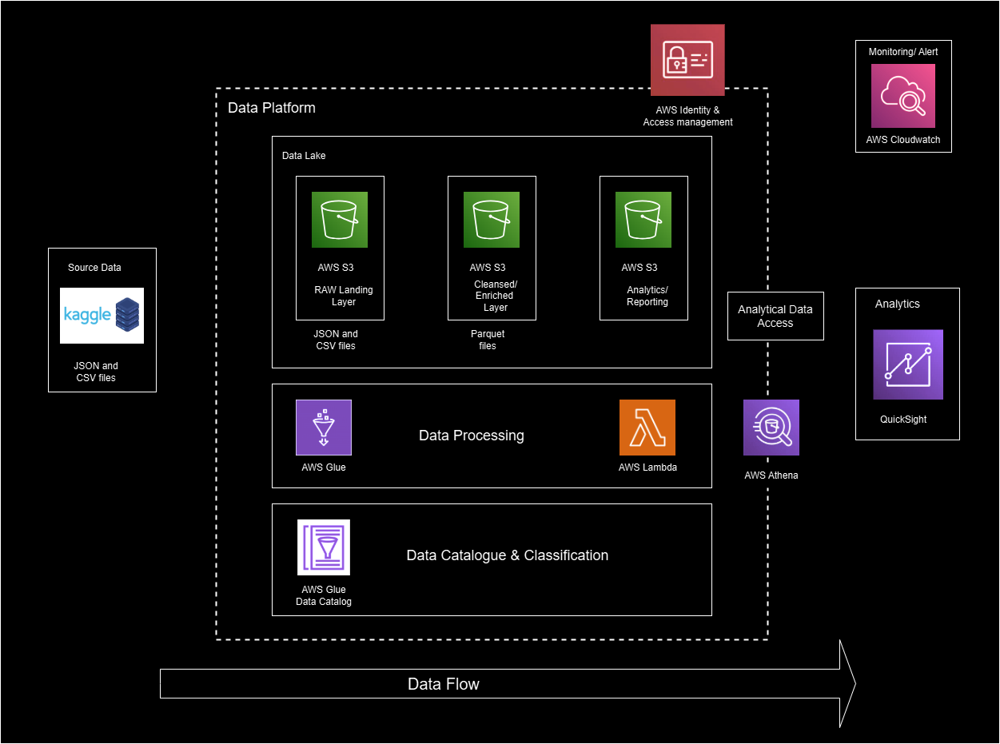

# Youtube Data Analytics | End-To-End Data Engineering Project Using AWS

## Introduction
This project demonstrates an end-to-end data engineering pipeline for analyzing YouTube data using AWS services. By leveraging tools like AWS Glue, S3, Lambda, Athena, and QuickSight, the pipeline enables seamless data ingestion, transformation, and visualization. The aim is to provide insights into YouTube video performance, audience engagement, and content trends. This repository serves as a comprehensive guide for building scalable, cloud-native analytics solutions.

## Architecture

## Services Used
1. AWS IAM: AWS Identity and Access Management (IAM) enables secure control of access to AWS resources by defining permissions and policies for users, groups, and roles.
2. AWS S3: Amazon Simple Storage Service (S3) is a scalable, durable, and secure object storage service that allows users to store, retrieve, and manage data in the cloud with virtually unlimited capacity.
3. AWS Glue: AWS Glue is a fully managed, serverless ETL (Extract, Transform, Load) service that simplifies data preparation and integration by automating schema discovery, transformations, and job execution across various data sources.
4. AWS Lambda: Lambda is a computing service that allows programmers to run code without creating or managing servers.
5. AWS Athena: Athena is an interactive query service for S3 in which there is no need to load data it stays in S3.
6. QuickSight: Amazon QuickSight is a scalable business intelligence tool that allows you to create interactive dashboards and visualize data from multiple sources in real time.
